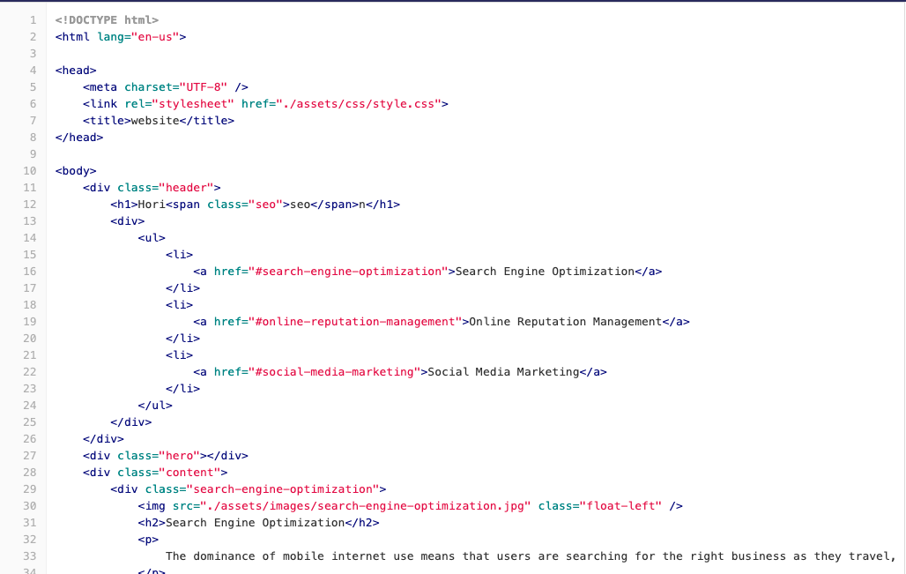
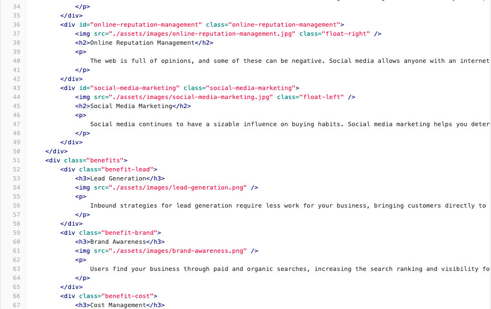
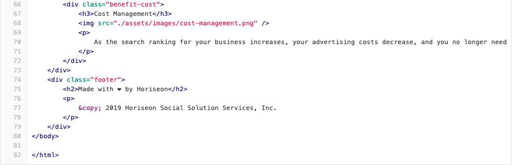
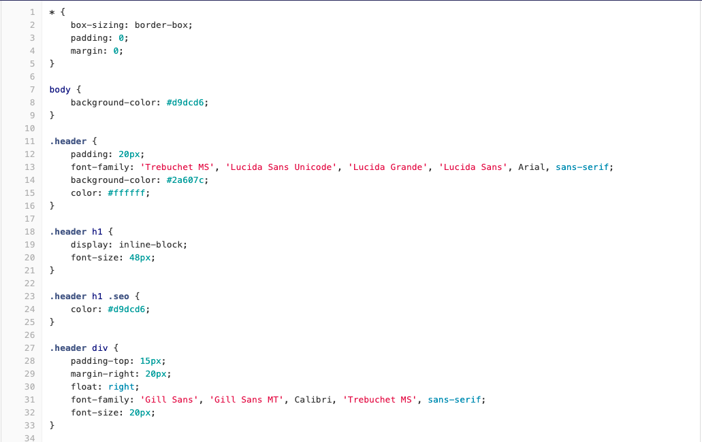
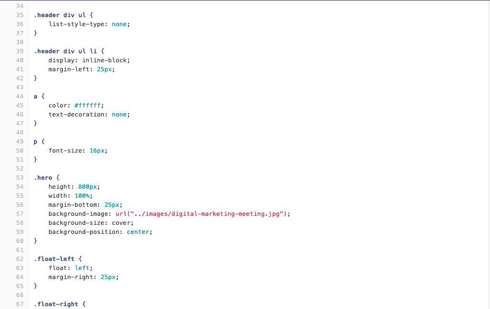
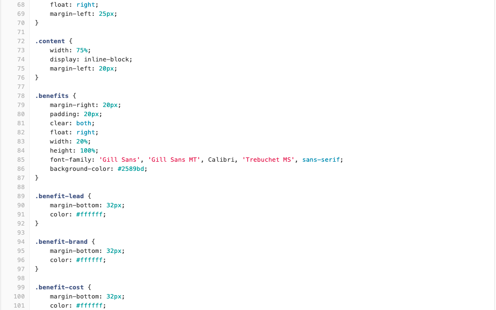
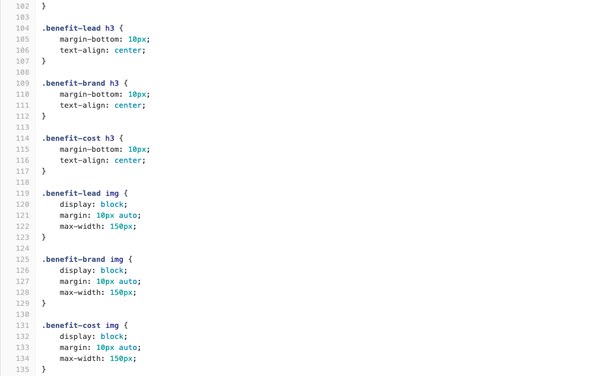
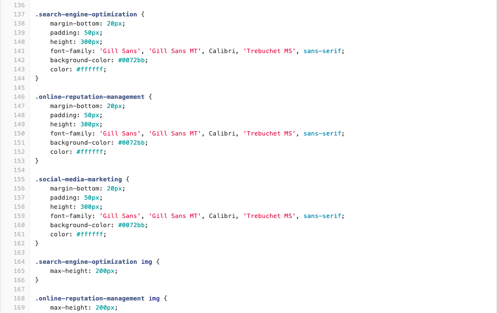
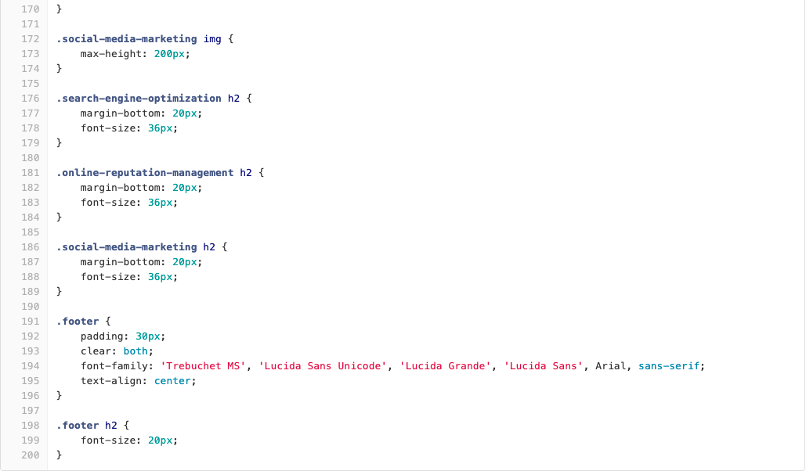

# Marketing Agency Mock-up
## Introduction  
This is a mockup project. I was tasked to refactor an existing website of a marketing agency and make it more accessible.
I was challenged to improve my HTML and CSS coding knowledge which is a common task for front-end and junior developers..
```
The result of this enhancement project includes: 
- Webpage meets accessibility standards 
- The structure of the HTML elements is semantic 
- The icon and image elements are following a logical structure independent of styling and positioning
- Icon and image elements has accessible alt attributes
- The heading attributes fall in sequential order
- The title element is descriptive and working clearly and succinctly
```
This task helped me to expand my HTML and CSS knowledge as well as make me more familiar with GitHub platform.

## Table of Contents 

- [Installation](#installation)
- [Usage](#usage)


## Installation
To get the development environment running started by changing and fixing the HTML elements from top to bottom and as well as ensuring the CSS cods selector names are also changed. Also, I made sure that the website structure and layout  was not changed  after editing. Moreover, making sure the cods are clean and adding comments to make them easy to read. 

## Usage
The page  layout design did not have visual break downs that I could take screen shots. The project was mainly about editing and enhancing the HTML and CSS code without changing the  layout design of the webpage. However, the tittle was changed. 
Instead, I provide some screen shots from the breaking cods for evaluate the results. 

# The following image shows HTML starter cods: 


# The following image shows CSS starter cods: 


# This following image shows the web application's appearance and functionality:


> **Note**: This layout is designed for desktop viewing, so you may notice that some of the elements don't look like the mock-up at a resolution smaller than 768px.
